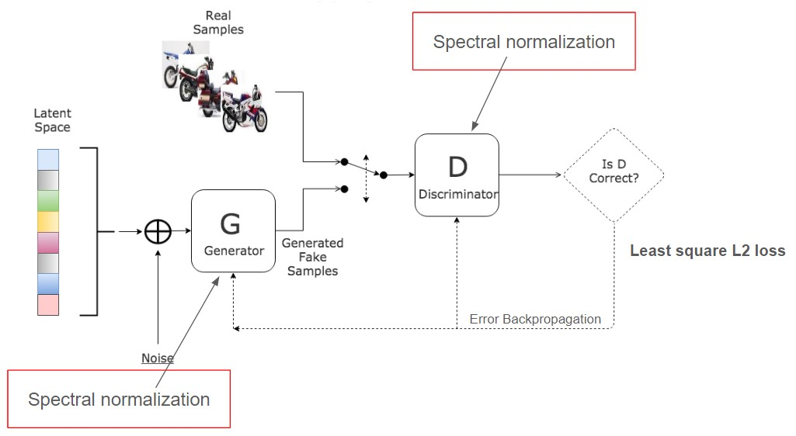
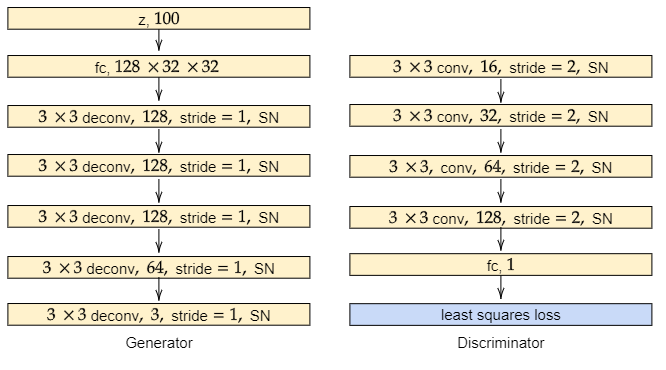
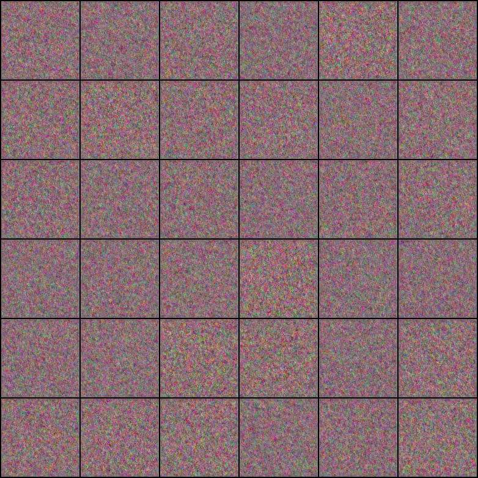
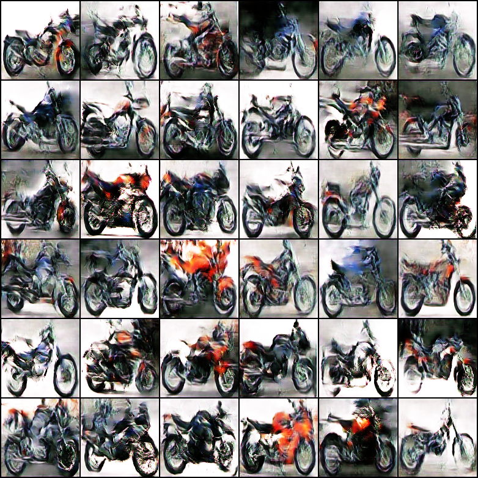
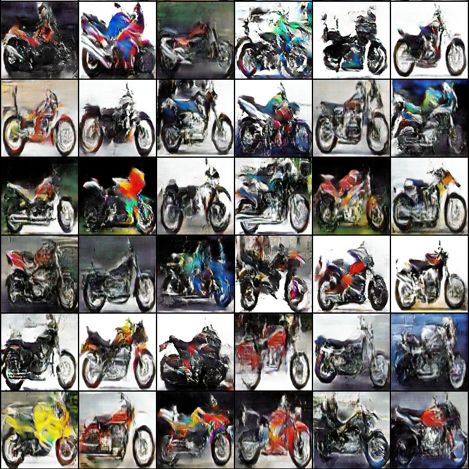
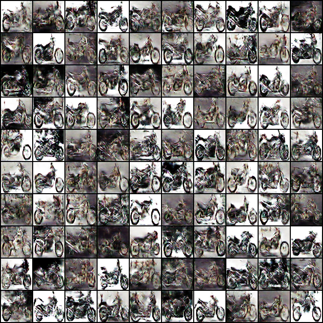
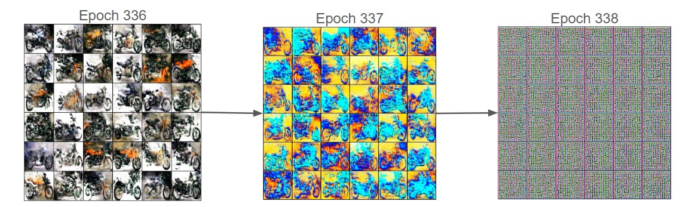
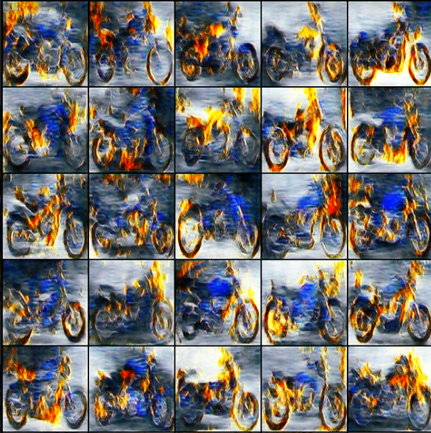

# Generating motorbike images using LSGAN.

# Overview
In this work, the spectral normalization technique is applied to LSGANS to synthesize new motorbike color images. Results of this project might help researchers who are working on traffic recognition systems that need to recognize motorbikes, especially research in Vietnam. In fact, motorcycles are essential parts of Vietnamese daily lives because they are the main transportation vehicles there.  

# Architecture

  
 

# Preliminary Results
From left to right: Epoch 0, Epoch 2000, Epoch 20000

  
  
  

# Why training GAN is challenging?
## Mode collapse
In short, mode collapse is the situation that the generator Gproduces limited varieties of data, i.e., it always provide similar outputs (images in this case) for every random inputs. Mode collapse occurs when the discriminator learning too fast as compared to the generator. The below fig shows several similar images generated by a generator that having mode collapse issue. We can see from the figure that only narrow range of colors are used, which makes the bikes have similar looks. We had this issue when using only the public Kaggle dataset. We overcome mode collapse by adding more data and balancing the learning rates of the generator and the discriminator.

## Gradient vanishing/exploding
The training process of GANs is based on gradient back-propagations. Hence, GANs also have gradient related issues like other neural network architectures. In general, gradient vanishing is when the model hardly learns anything because the gradient is too small and cannot back-propagate well through every layer. In contrast, gradient exploding is when the gradient is too large which makes the model learns in non-optimal way. This issue may leads to performance fluctuation or may even blow up our model. The below fig shows an example of gradient exploding, which we met during training our model. As we can see in the figure, the learning process is going well in epoch 336, then the gradient exploded and the images are worse in epoch 337. After that, the generator can only produce random noise as we can see in epoch 338. When this issue happens, we have to train the model from the beginning again. A workaround for this issue is saving multiple checkpoints of our model during training to avoid training from scratch repeatedly. 

## Unexpected behavior of GANs training process
I'm pretty sure that no Ghost Rider's vehicle included in the training dataset! Still, the results look like his bike!

# Code
Available soon!
